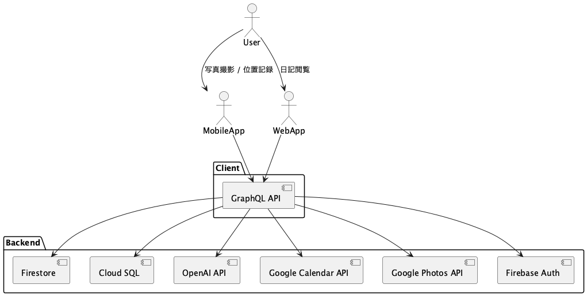
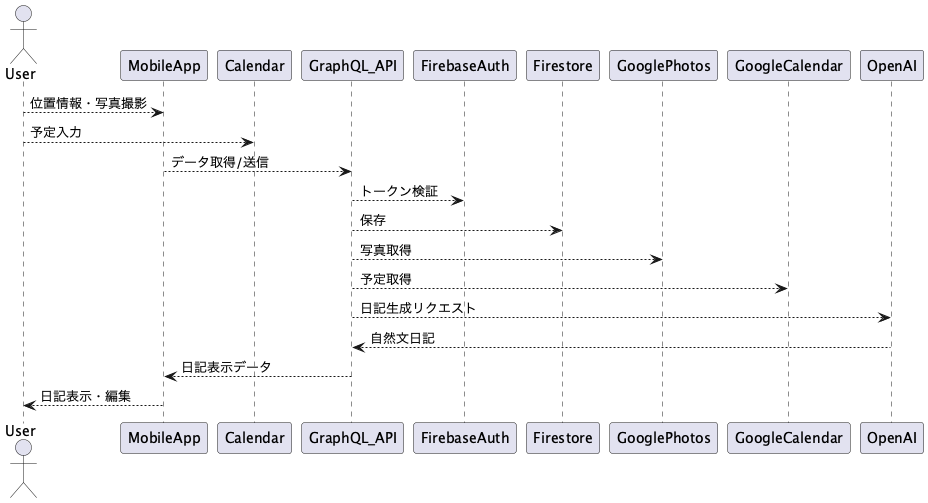

# Toki - AI日記アプリ

AIを活用した日記アプリケーションのモノレポです。

## 技術スタック

- **フロントエンド**: Next.js 14 (App Router), React 18, TypeScript
- **バックエンド**: Node.js, Express, Apollo Server (GraphQL)
- **モバイル**: Flutter
- **スタイリング**: Tailwind CSS
- **状態管理**: Zustand
- **データベース**: Firebase
- **AI**: OpenAI API

## セットアップ

### 前提条件

- Node.js >= 18.0.0
- npm >= 9.0.0 または yarn >= 1.22.0
- Flutter (モバイルアプリ開発用)

### インストール

```bash
# 依存関係のインストール
yarn install

# モバイルアプリの依存関係（Flutter）
cd apps/mobile && flutter pub get
```

### 開発サーバーの起動

```bash
# WebアプリとAPIサーバーを同時起動
yarn dev

# 個別起動
yarn dev:web    # Webアプリ (http://localhost:3000)
yarn dev:api    # APIサーバー (http://localhost:4000)
```

### テスト

```bash
# 全テスト実行
yarn test

# 個別テスト
yarn test:web   # Webアプリのテスト
yarn test:api   # APIのテスト
```

### リント

```bash
# 全リント実行
yarn lint

# 個別リント
yarn lint:web   # Webアプリのリント
yarn lint:api   # APIのリント
```

### ビルド

```bash
# 全ビルド
yarn build

# 個別ビルド
yarn build:web  # Webアプリのビルド
yarn build:api  # APIのビルド
```

## プロジェクト構造

```
toki/
├── apps/
│   ├── web/          # Next.js Webアプリケーション
│   └── mobile/       # Flutter モバイルアプリ
├── packages/
│   ├── api/          # GraphQL APIサーバー
│   ├── shared/       # 共有型定義とユーティリティ
│   ├── db/           # データベース関連
│   └── ai/           # AI機能
└── docs/             # ドキュメント
```

## 開発ガイド

### 新しい機能の追加

1. 適切なパッケージ/アプリに機能を追加
2. 型定義を `packages/shared` に追加
3. GraphQLスキーマを更新
4. テストを追加
5. リントを実行してコード品質を確認

### コミットメッセージ

- `feat:` 新機能
- `fix:` バグ修正
- `docs:` ドキュメント更新
- `style:` コードスタイル修正
- `refactor:` リファクタリング
- `test:` テスト追加・修正
- `chore:` その他の変更

## ライセンス

MIT

# Toki

[](LICENSE)
[](https://github.com/your-repo/toki)


## 📖 概要

Tokiは、ユーザーの位置情報・写真・カレンダー予定をもとに、毎日を自動で記録・提案するAI日記アプリです。
「気づいたら記録されている」自然な日記体験を提供し、忙しい日常の中でも大切な瞬間を自動でアーカイブします。

---

## 🏗️ モノレポ構成

```
toki/
├── apps/
│   ├── mobile/          # Flutterモバイルアプリ
│   └── web/             # Next.js Webアプリ
├── packages/
│   ├── api/             # GraphQL BFF API
│   ├── db/              # データベース操作
│   ├── ai/              # AI連携モジュール
│   └── shared/          # 共有型定義・ユーティリティ
├── docs/
│   ├── project_spec.md  # プロジェクト仕様書
│   └── diagrams/        # アーキテクチャ図
└── README.md
```

---

## 🚀 クイックスタート

### 前提条件
- Node.js 18+
- Flutter 3.0+
- Docker (開発環境)

### セットアップ

```bash
# リポジトリのクローン
git clone https://github.com/your-repo/toki.git
cd toki

# 依存関係のインストール
npm install

# 開発サーバーの起動
npm run dev
```

### 各アプリケーションの起動

```bash
# Webアプリ
cd apps/web
npm run dev

# APIサーバー
cd packages/api
npm run dev

# モバイルアプリ
cd apps/mobile
flutter run
```

---

## 🧱 技術スタック

| レイヤ | 技術構成 |
|--------|----------|
| モバイル | Flutter + Riverpod + Drift |
| Web | Next.js + TypeScript + Apollo Client |
| バックエンド | GraphQL（Apollo Server）|
| データベース | Firestore / Cloud SQL + Prisma |
| 認証 | Firebase Auth |
| AI生成 | OpenAI API / Vertex AI |
| インフラ | GCP（Cloud Run + GitHub Actions）|

---

## 📋 機能要件（MVP）

- 位置情報の自動取得（滞在場所＋時間）
- 写真との自動紐づけ（Google Photos APIなど）
- カレンダーから予定情報の取得（Google Calendar）
- AIによる日記生成（OpenAI API等）
- 編集・保存・削除機能
- カレンダーUIによる振り返り
- 週次／月次のハイライト自動生成

---

## 🏗️ アーキテクチャ



## 🔧 システム構成図（データフロー）



---

## 📚 ドキュメント

- [プロジェクト仕様書](docs/project_spec.md) - 詳細な要件・設計ドキュメント
- [アーキテクチャ図](docs/diagrams/) - PlantUMLによる構成図

### 図表の生成

```bash
# PlantUMLで画像を生成
cd docs
./generate_images.sh
```

---

## 🔧 開発

### GraphQLスキーマ駆動開発

1. `packages/shared/graphql/schema.graphql`でスキーマを定義
2. `npm run codegen`で型定義を生成
3. 各アプリケーションで型安全なGraphQL操作を実装

### パッケージ間の依存関係

```
packages/shared ← packages/api
packages/shared ← apps/web
packages/shared ← apps/mobile
```

---

## 📝 ライセンス

このプロジェクトは MIT ライセンスの下で公開されています。

---

