# Toki AutoDiary データフロー・シーケンス図

## 概要

このドキュメントでは、Toki AutoDiaryアプリケーションの主要なデータフローとシーケンスを詳しく説明します。

## 1. アプリケーション起動シーケンス

### モバイルアプリ起動

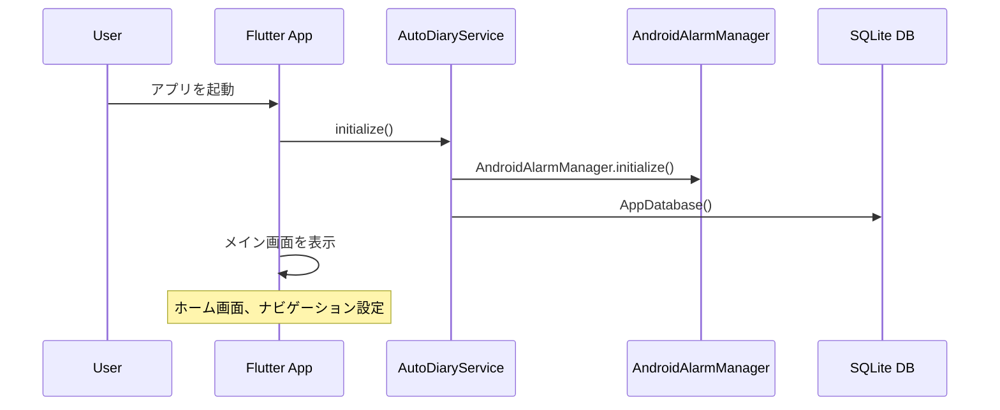

### バックエンド起動

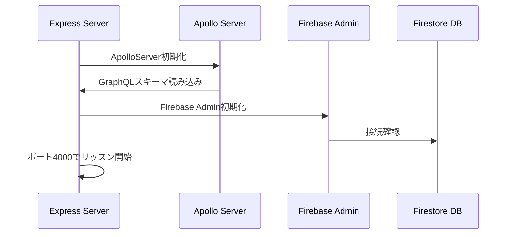

## 2. 位置情報追跡シーケンス

### 位置情報追跡開始

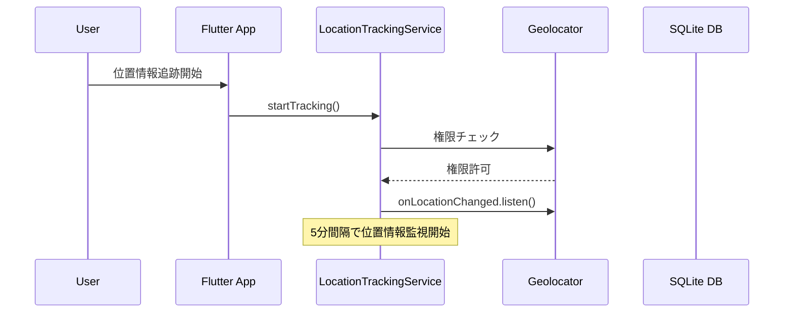

### 位置情報取得・保存

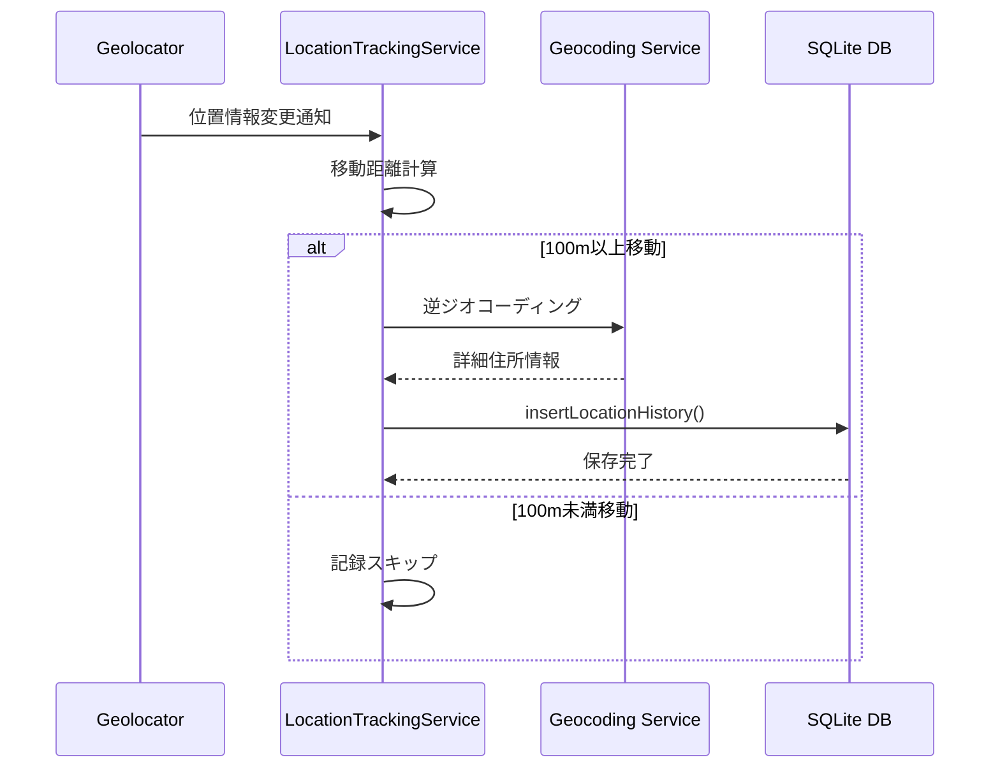

## 3. 自動日記生成シーケンス

### バックグラウンド日記生成

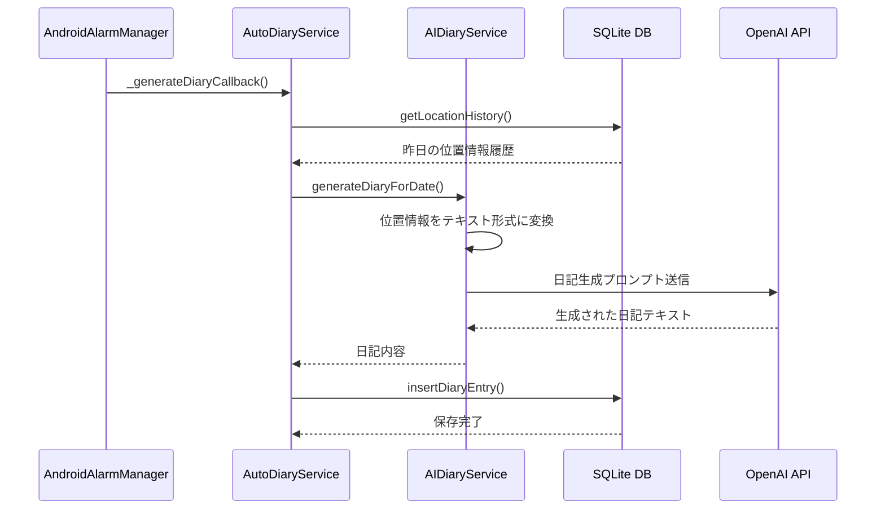

### 手動日記生成

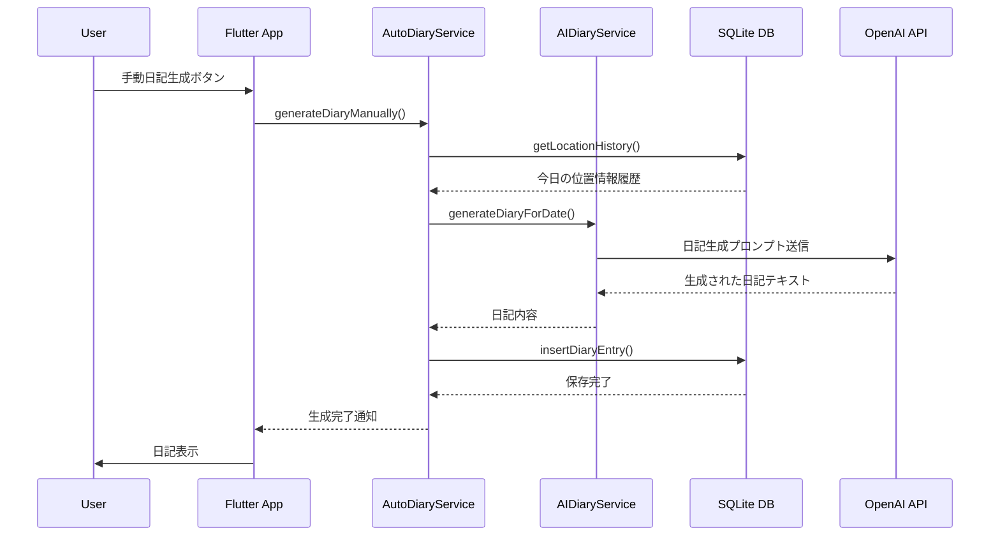

## 4. GraphQL API シーケンス

### 日記取得

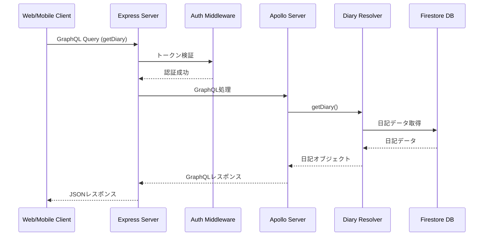

### 日記作成

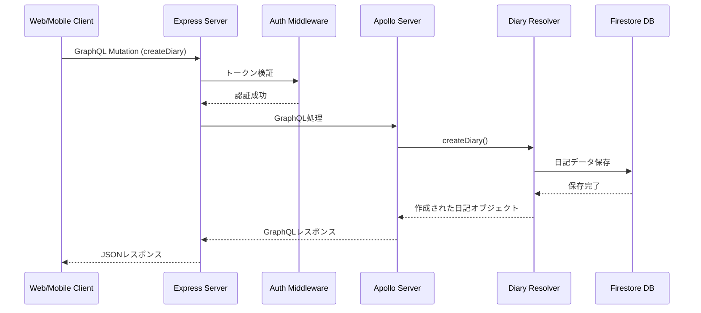

## 5. AIサービス シーケンス

### 日記生成プロセス

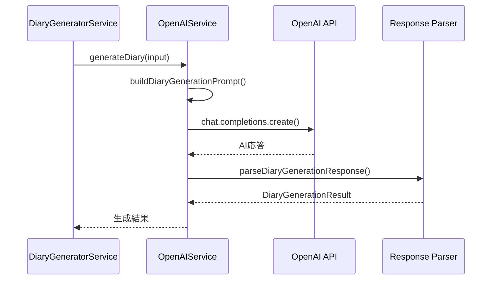

### 日記分析プロセス

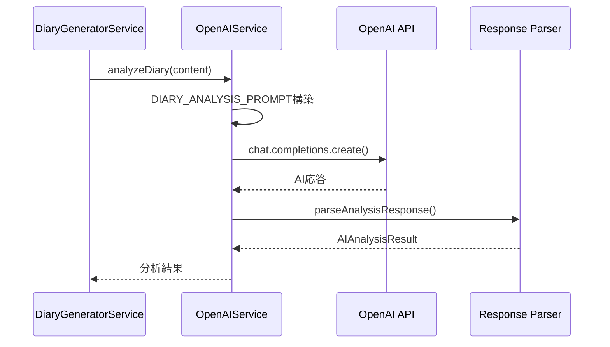

## 6. 認証フロー

### Firebase認証

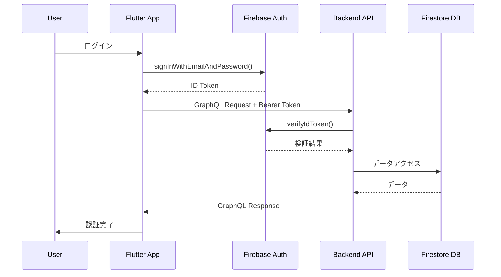

## 7. データ同期フロー

### ローカル→クラウド同期

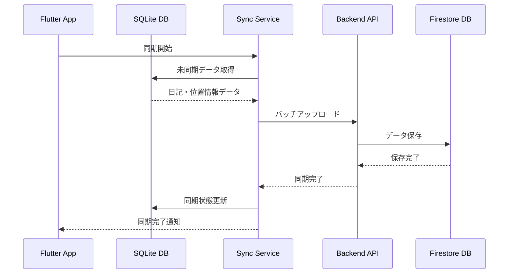

### クラウド→ローカル同期

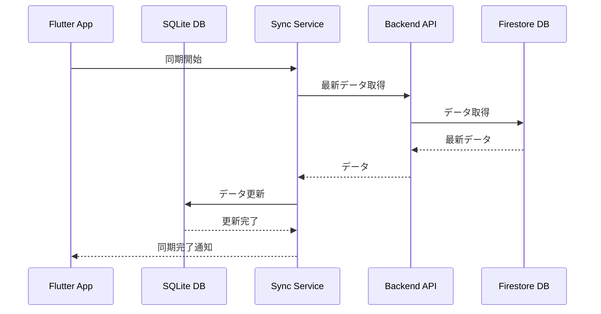

## 8. エラーハンドリングフロー

### API エラー処理

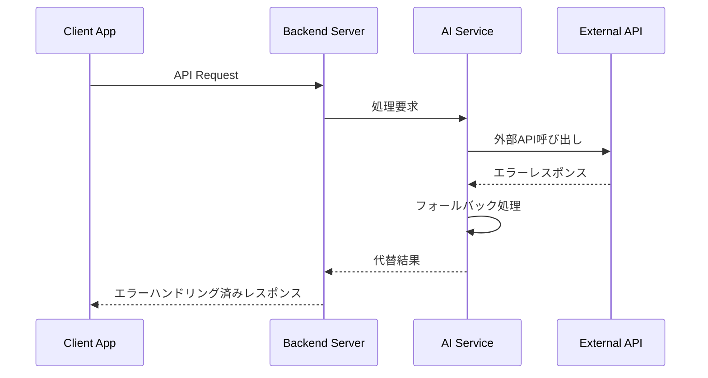

### ネットワークエラー処理

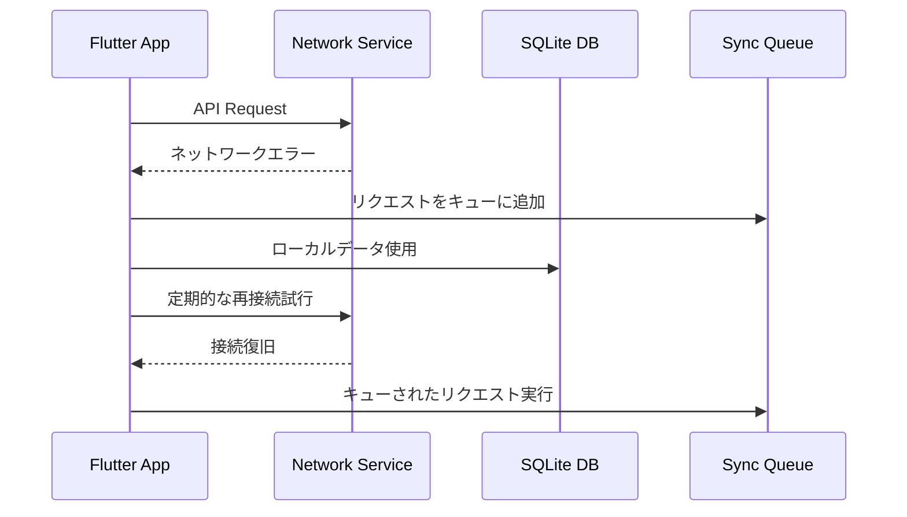

## 9. パフォーマンス最適化フロー

### バッテリー最適化

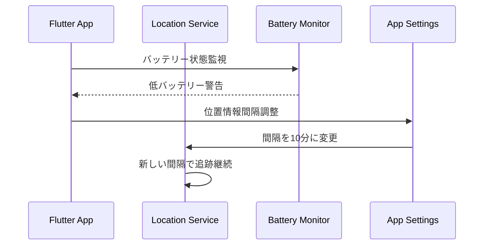

### データベース最適化

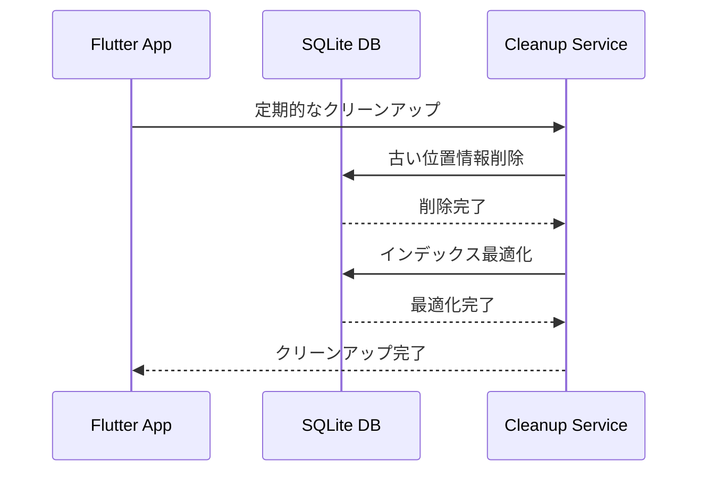

## 10. 監視・ログフロー

### ログ収集

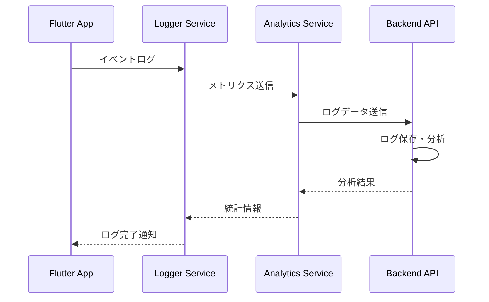

これらのシーケンス図は、Toki AutoDiaryアプリケーションの主要なデータフローと処理の流れを示しています。各コンポーネント間の相互作用と、データの流れを理解するのに役立ちます。 